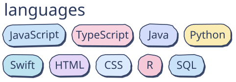
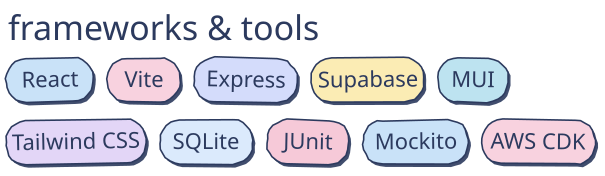

<h1>hi, i'm gulnas!</h1>

## about me! 
- studying computer science at northeastern
- very interested in **human-centered computing**!

## when i'm not coding...
- crocheting amigurumi stuffed animals
- baking
- watching documentaries (or movies)
- or sleeping in...

## what i work with
 

